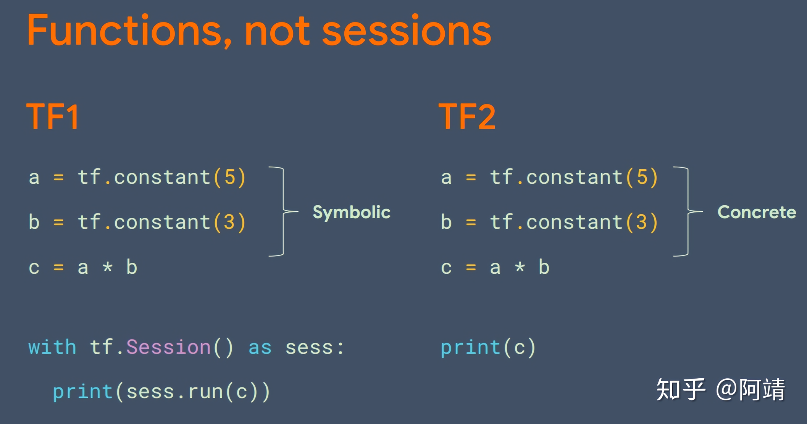
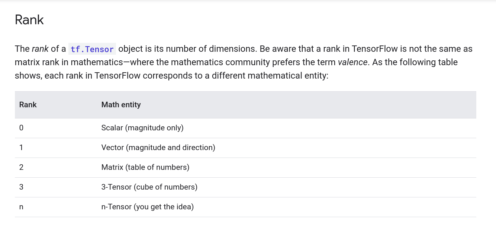

# Tensor-Ranking-Types
What is Tensor ? Different types of Tensors Ranking.

# Library Installations:
 
- pip install opencv-contrib-python    (OpenCV)

- conda install -c conda-forge matplotlib  (Matplotlib Data Visualization Tools)

- pip install tensorflow (Tensorflow 2.0)
- conda install -c anaconda tensorflow-gpu  (Tensorflow GPU 2.1)

# Run Jupyter Notebook
- Lesson 1 Tensor Data Types.ipynb

